# EXTRA VPN — анализ конкурента

**Дата:** 2026-05-08
**Источник:** 12 скриншотов прохождения от старта до выдачи sub-link
**Аналитик:** Devin + aziz
**Скриншоты:** [`competitor-extravpn-screens/`](./competitor-extravpn-screens/)

---

## TL;DR

EXTRA VPN — типичный «**бот-кнопочник**» без Mini App. Весь UX живёт в самом
чате Telegram через **reply-keyboard внизу + inline-кнопки под сообщениями**.
Reply-keyboard постоянная (4 кнопки навигации), inline — контекстные
(тарифы/устройства/оплата).

Главные UX-отличия от нас:
- У них **explicit consent** (Согласен), у нас неявно через `/info → Terms`.
- У них **gating через подписку на канал** до старта, у нас `/bonus` опционально.
- У них **внутренний баланс** (топ-ап + списание), у нас `users.balance` только для партнёрок.
- У них **per-device pricing с произвольным числом до 99**, у нас фиксированный список.
- У них **«Авто продление», «Подарить», «Арендовать устройство», «Перевыпустить ссылку»** — у нас ничего из этого.

Ниже — карта экранов, кнопок и решение по каждой.

---

## Карта экранов

### 1. Welcome (`/start`)
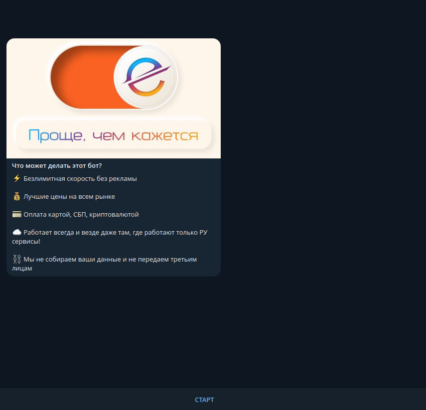

Брендовый баннер «Проще, чем кажется» + 5 буллетов:
- ⚡ Безлимитная скорость без рекламы
- 💰 Лучшие цены на всём рынке
- 💳 Оплата картой, СБП, криптовалютой
- ☁️ Работает везде, даже там, где работают только РУ-сервисы
- ⏬ Мы не собираем ваши данные

Снизу одна inline-кнопка **`Согласен`** (consent gate перед обработкой).

### 2. Welcome в Mini App-режиме
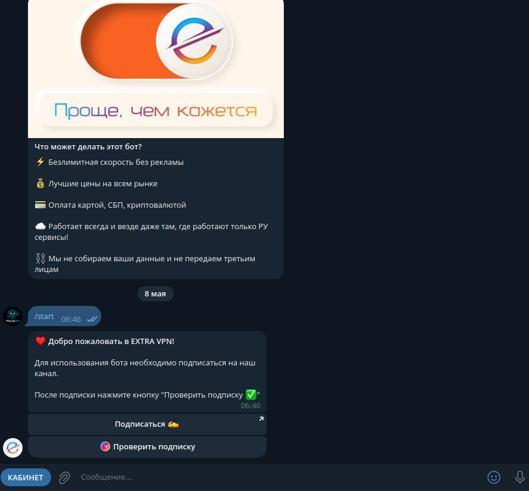

Тот же текст в режиме Mini App-iframe (когда юзер открыл из веба) — внизу
**`СТАРТ`** (одна полноширинная reply-кнопка).

### 3. Channel-subscription gate
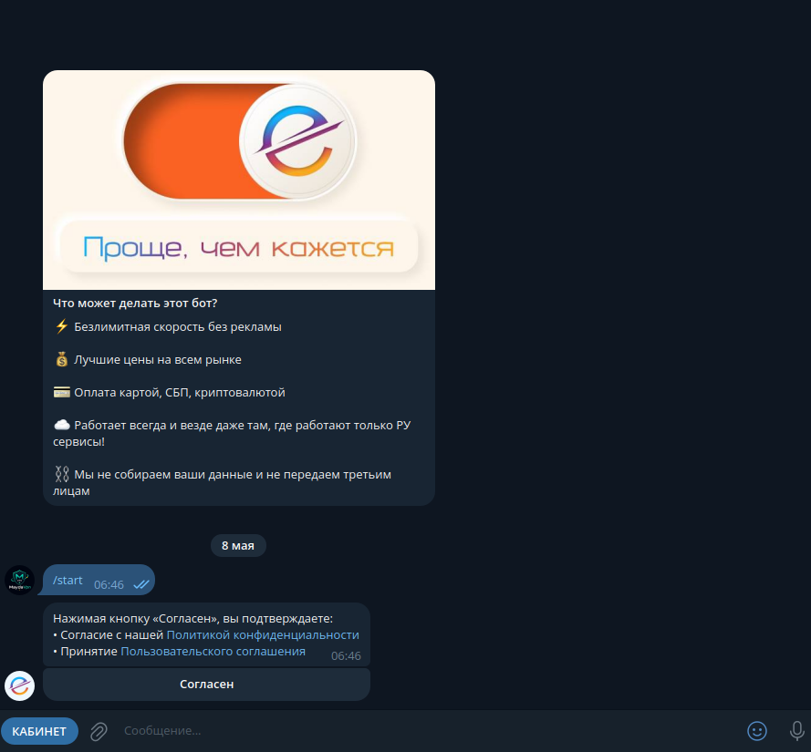

> ❤️ Добро пожаловать в EXTRA VPN!
> Для использования бота необходимо подписаться на наш канал.
> После подписки нажмите кнопку "Проверить подписку ✅"

Inline-кнопки:
- **`Подписаться 📨`** — URL на канал
- **`Проверить подписку`** — callback

Это **обязательный gate** — без подписки на канал юзер не может пользоваться
ботом. Растит подписчиков канала, но режет конверсию.

### 4. Главное меню (после прохождения gate)
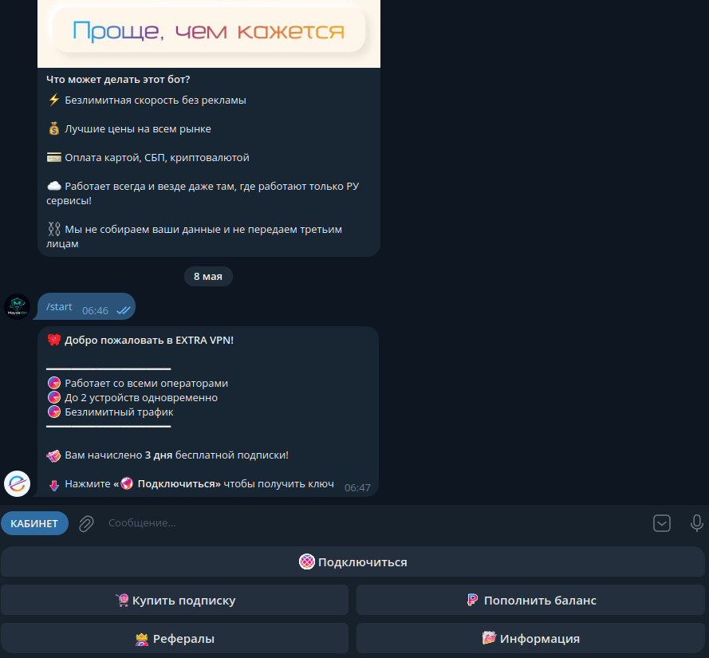

Карточка приветствия:
> 🎮 Добро пожаловать в EXTRA VPN!
> ⏰ Работает со всеми операторами
> ⏰ До 2 устройств одновременно
> ⏰ Безлимитный трафик
> 🎁 Вам начислено **3 дня** бесплатной подписки!
> ⏬ Нажмите «🌐 Подключиться» чтобы получить ключ

После тапа на reply-кнопку «🌐 Подключиться» открывается **inline-список тарифов**:
- 1 месяц — 199₽
- 3 месяца — 550₽
- 6 месяцев — 1100₽
- **12 месяцев — 1999₽** (зелёный = «лучшее»)
- ◀️ Назад

И постоянная **reply-keyboard** внизу:
```
[ 🌐 Подключиться (полная ширина) ]
[ 🛒 Купить подписку │ ₽ Пополнить баланс ]
[ 👥 Рефералы        │ 🗂 Информация ]
```

### 5. Выбор количества устройств
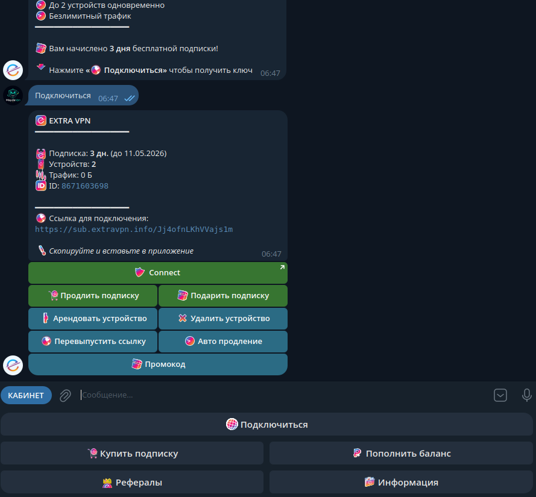

После выбора срока:
> 📱 Тариф: 1 мес.
> 📱 Выберите количество устройств:

Inline-кнопки:
- 2 устройства — 199₽
- 3 устройств — 289₽
- 4 устройств — 379₽
- 5 устройств — 469₽
- 6 устройств — 559₽
- 7 устройств — 649₽
- **🖋 Ввести своё число (до 99)** — отдельная кнопка
- ◀️ Назад

Цена линейная: ~+90₽ за каждое доп.устройство (199₽ за 2 → 289₽ за 3 →
+90 → +90 → +90).

### 6. Кабинет с активной подпиской
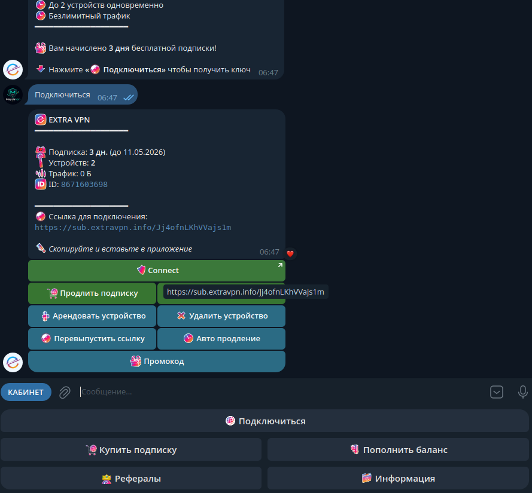

```
🌐 EXTRA VPN
─────────────
📅 Подписка: 3 дн. (до 11.05.2026)
📱 Устройств: 2
📊 Трафик: 0 Б
🆔 ID: 8671603698
─────────────
🔗 Ссылка для подключения:
https://sub.extravpn.info/Jj4ofnLKhVVajs1m
🖋 Скопируйте и вставьте в приложение
```

Inline-кнопки (большое меню действий):
- **`Connect`** (большая зелёная — открывает sub-link напрямую)
- `Продлить подписку` │ `[раскрытый sub-link]` (text-input-style для копирования)
- `Арендовать устройство` │ `Удалить устройство`
- `Перевыпустить ссылку` │ `Авто продление`
- `Промокод`

### 7. Оплата с балансом 0₽
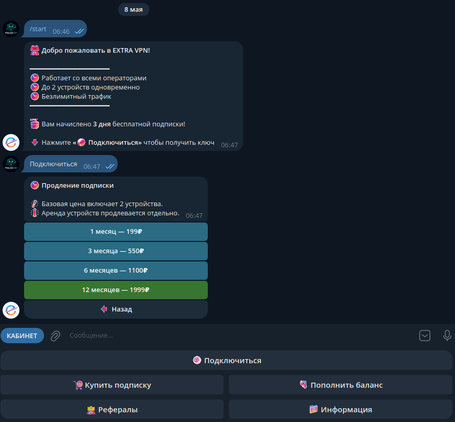

```
💳 ОПЛАТА
─────────────
📦 К оплате: 199₽
⏰ Счёт действителен 30 минут
```

Inline-кнопки:
- **`💳 Оплатить 199₽`** (зелёная, URL на провайдера)
- `❌ Отменить`

### 8. Кабинет с возможностью «Подарить»
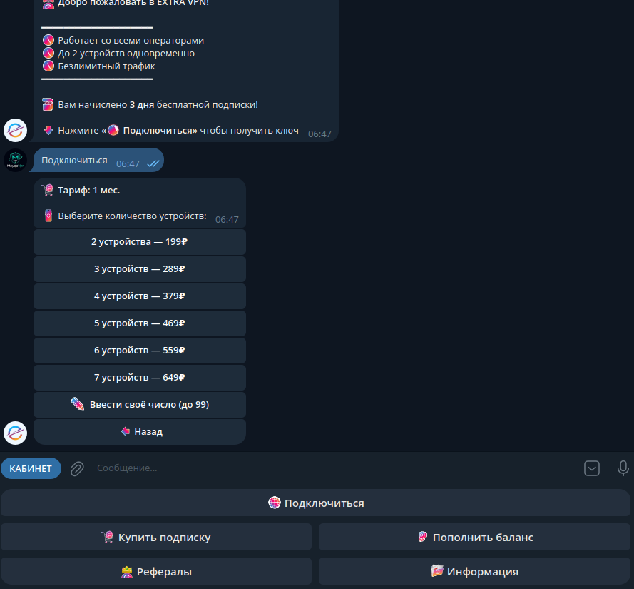

Тот же кабинет, но 6-я строка inline-кнопок включает **`🎁 Подарить подписку`**
рядом с `🛒 Продлить подписку`. Появляется не для всех (видимо, у юзера с
активной подпиской).

### 9. Альтернативный flow оплаты — выбор провайдера
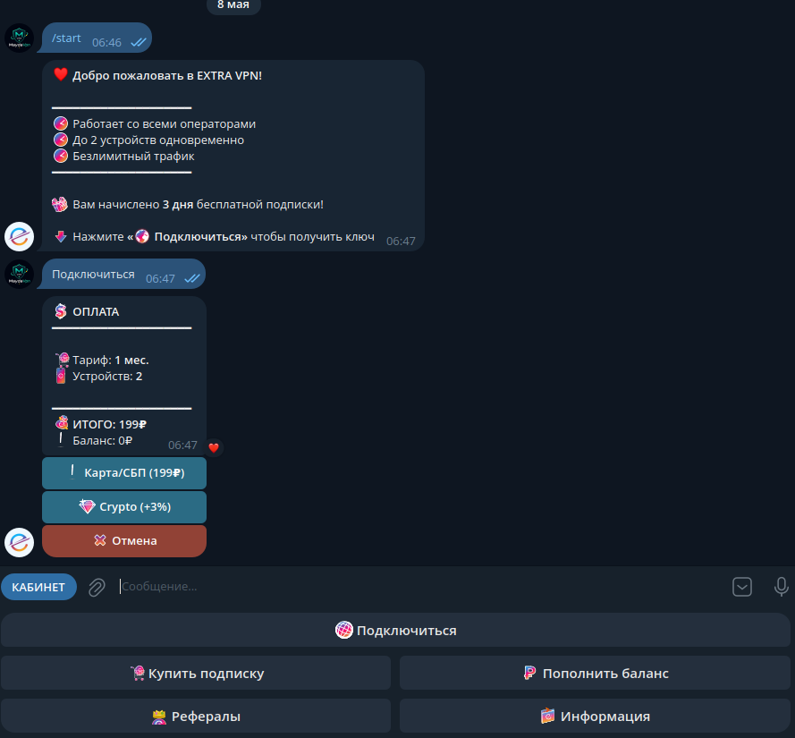

```
🛒 ОПЛАТА
─────────────
📅 Тариф: 1 мес.
📱 Устройств: 2
📦 ИТОГО: 199₽
❗ Баланс: 0₽
```

Inline-кнопки выбора способа:
- `❗ Карта/СБП (199₽)`
- `💎 Crypto (+3%)` ← скидка/бонус за крипту
- `❌ Отмена`

### 10. Кабинет (повтор экрана 6 для контекста)
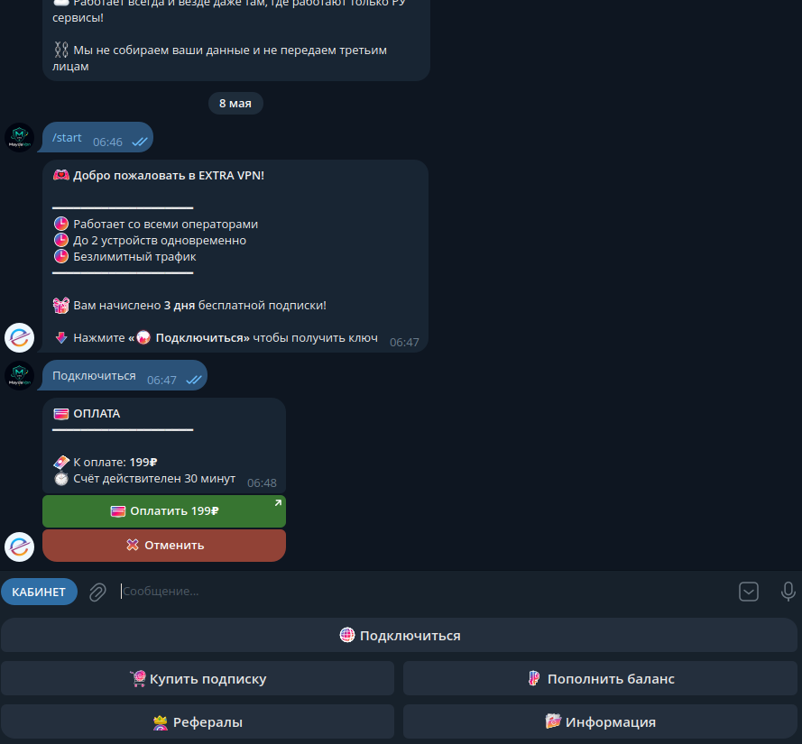

### 11. Подтверждение перехода по sub-ссылке
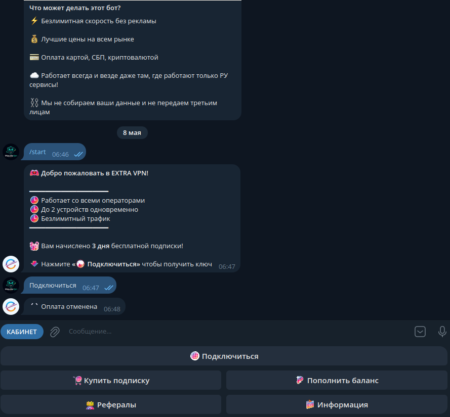

```
Перейти по ссылке?
https://sub.extravpn.info/Jj4ofnLKhVVajs1m
[ Отмена ]  [ Перейти ]
```

Стандартный Telegram-confirm при тапе на URL — у них кнопка `Connect` в
кабинете триггерит этот стандартный flow.

### 12. После отмены оплаты
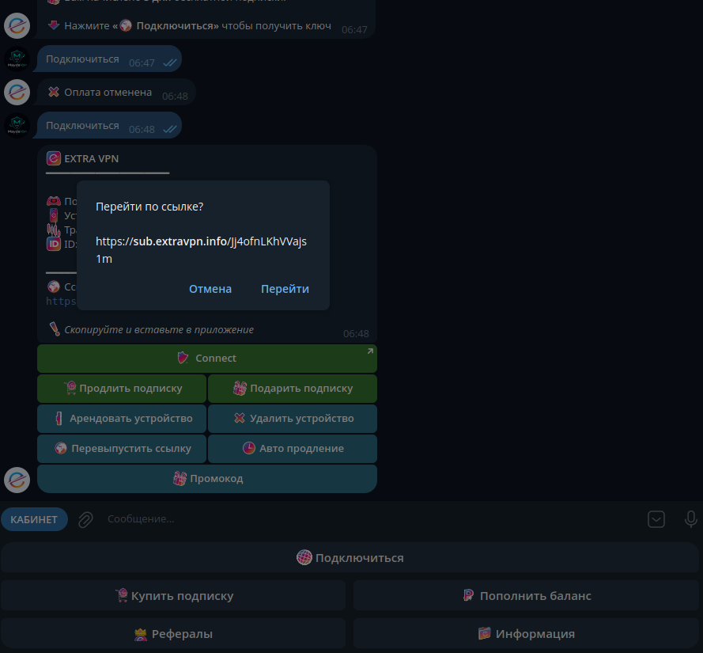

Системный ответ:
> ✅ Оплата отменена

И возврат в главное меню (welcome-сообщение остаётся выше в истории).

---

## Маппинг кнопок на наш стек

Легенда: **✅ есть** · **🟡 частично** · **🔴 нет** · **⏭ пропускаем**

| Конкурент | Наш аналог | Статус | Решение |
|---|---|---|---|
| `Согласен` (consent) | `/info` Terms modal | 🟡 | Отложено. Не критично без юр.требования. |
| `Подписаться` + `Проверить подписку` (gate) | `/bonus` (опциональный) | 🟡 | Не делаем gate — оставляем soft-bonus для канала. Конверсия выше. |
| Reply `🌐 Подключиться` | Mini App `/connect` | ✅ | **Делаем reply-кнопку которая показывает карточку статуса в чате + inline для Mini App.** |
| Reply `🛒 Купить подписку` | Mini App `/plans` | ✅ | **Делаем reply-кнопку которая показывает тарифы в чате + inline для Mini App.** |
| Reply `₽ Пополнить баланс` | — | 🔴 | **НЕ делаем сейчас.** Внутренний кошелёк = большая фича, метрики не оправдывают (5 платящих юзеров). |
| Reply `👥 Рефералы` | Mini App `/referral` | ✅ | Не делаем дублирование в чате — Mini App богаче. |
| Reply `🗂 Информация` | Mini App `/info` | ✅ | Аналогично — Mini App богаче. |
| Inline `1мес/3мес/6мес/12мес` | `/plans/v2` | ✅ | Делаем кнопку «💳 1мес — 199₽» как quick-buy в чате + ссылку на Mini App для остальных. |
| Inline `2/3/4/5/6/7 устройств` + «Своё число» | `getDevicePricing()` | 🟡 | Не делаем сейчас — usage показывает что 2 устройства покрывает 95% юзеров. |
| Inline `Crypto (+3%)` | — | 🔴 | Откладываем, нет провайдера. |
| Inline `Connect` (большая зелёная) | `/connect` Mini App | ✅ | Эквивалент — кнопка-WebApp на /connect. |
| Inline `Продлить подписку` | renew flow в `/plans` | ✅ | Существует (просто открыть Mini App залогиненым). |
| Inline `Подарить подписку` | — | 🔴 | Откладываем. Требует balance + promo-NULL. |
| Inline `Арендовать устройство` | — | 🔴 | Откладываем. Mid-subscription расширение. |
| Inline `Удалить устройство` | `disconnectDevice()` | ✅ | В Mini App `/devices`. |
| Inline `Перевыпустить ссылку` | — | 🔴 | Маленькая фича, отложена. |
| Inline `Авто продление` | — | 🔴 | Recurrent billing — откладываем. |
| Inline `Промокод` (юзер вводит) | `/promo/p/<token>` deep-link | 🟡 | Есть, но через ссылку, не текстовый ввод. Откладываем. |
| Текст «Счёт действителен 30 минут» | TTL invoice | 🟡 | TTL есть, но не показываем — UX-полиш на потом. |
| Inline `Оплатить 199₽` (URL) | `createInvoice` flow | ✅ | Делаем quick-buy кнопку в чате. |
| Системный «Оплата отменена» | — | 🔴 | Маленькая фича, добавляем как часть quick-buy flow. |

---

## Что заимствуем В ТЕКУЩЕЙ ЗАДАЧЕ (см. `tasks/18-bot-reply-keyboard.md`)

Минимальный MVP:
1. **Reply-keyboard `[🌐 Подключиться │ 🛒 Купить подписку]`** — постоянно видна.
2. **Card-ответ на «Подключиться»**: статус подписки в чате + 2 inline `[📱 Mini App │ 🔑 Получить ссылку]`.
3. **Card-ответ на «Купить подписку»**: список тарифов в чате + 2 inline `[💳 1мес — 199₽ │ 📱 Все тарифы]`.

Скидка с конкурентного UX: **рефералы и инфо** не дублируем в чат — у нас
Mini App информативнее. Reply-keyboard короче (2 кнопки вместо 5).

---

## Что НЕ заимствуем (отложено или нерелевантно)

| Фича | Причина |
|---|---|
| Channel-subscription gate | Режет конверсию. У нас сейчас 14% активации из 338 новых юзеров — ещё больше gate'ов добьют. |
| Внутренний баланс | 5 платящих юзеров — рано. Делается за неделю, отложено до >50 платящих. |
| Per-device pricing 2-99 | Большинство юзеров — 1-2 устройства. Не наша точка роста. |
| Crypto-провайдер | Нет интегрированного, новый адаптер — отдельная задача. |
| Auto-renew | Recurrent billing у Wata/Yoomoney нестабильный, юр. вопросы с подписками. |
| Подарить подписку | Зависит от баланса + promo-NULL flow. |
| Арендовать устройство | Mid-subscription — нужен прорейтинг + новая ручка. |
| Reply `Рефералы` / `Информация` | Mini App информативнее, дублирование лишнее. |

---

## Приоритеты следующих фич (если продолжаем)

После метрик от MVP (см. таску 18):

1. **Highlight 12мес-плана + invoice TTL в UI** — 5 минут работы, +X% к конверсии.
2. **«Перевыпустить ссылку»** — security feature, мелкая, полезная.
3. **«Промокод» (юзер вводит)** — усиление существующего 79₽-промо механизма (`broadcast_bounced.py`).
4. **Внутренний баланс** — когда платящих будет ≥50.
5. **Подарить + Auto-renew + Crypto** — не раньше Q2 2026.
