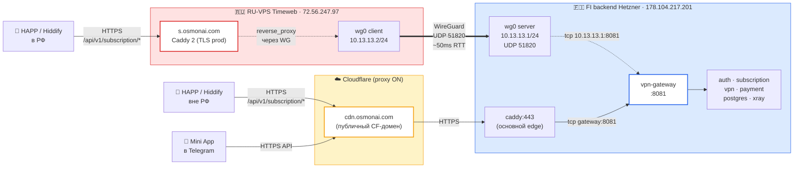
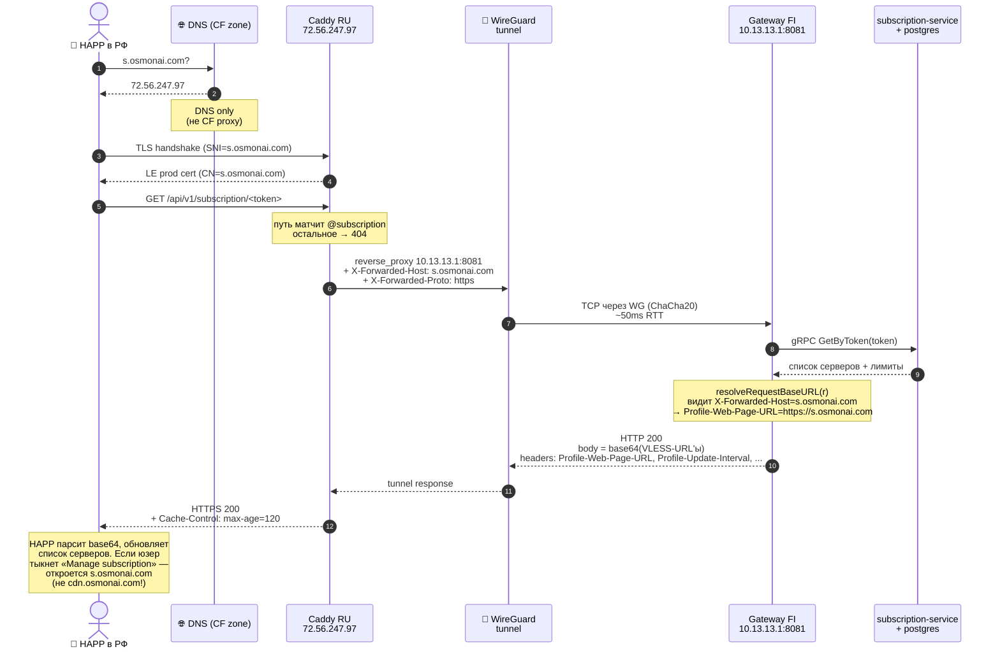
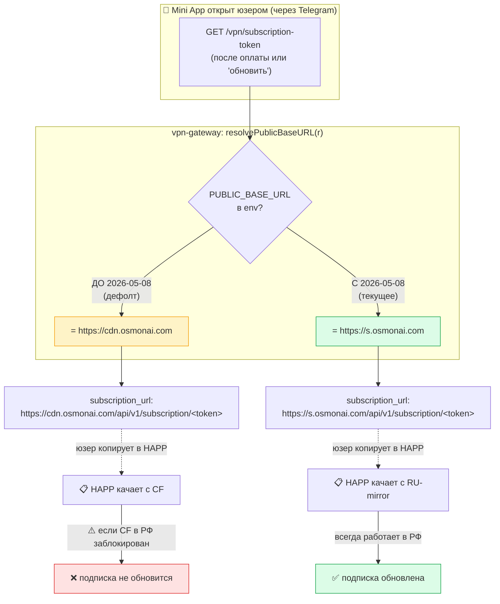
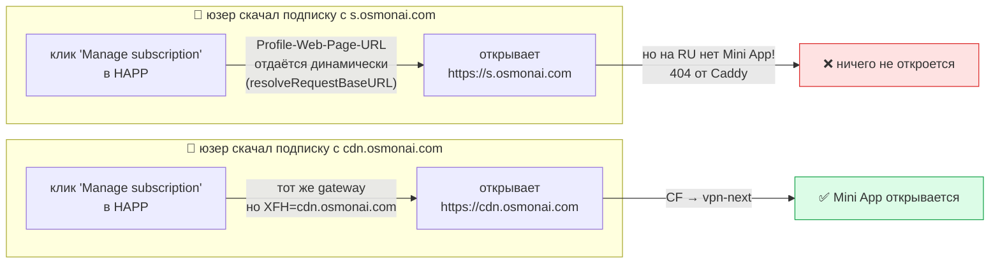

# RU-mirror подписочного эндпоинта (`s.osmonai.com`)

Как HAPP/Hiddify/V2RayNG-клиенты в РФ продолжают получать подписку,
если Cloudflare (где живёт `cdn.osmonai.com`) внезапно блокируется РКН.

**Статус реализации:** ✅ **в проде с 2026-05-08** (`s.osmonai.com → 72.56.247.97`, Timeweb RU)

**Куда сразу прыгать:**
- Меняешь RU-VPS на новый — [🔄 Замена RU-mirror на новый сервер (runbook)](#-замена-ru-mirror-на-новый-сервер-runbook)
- Откатываешь Mini App на CF (когда CF снова работает) — [Откат на CF за ~30 секунд](#откат-на-cf-за-30-секунд)
- Поломалось / отлаживаешь — [🔍 Мониторинг и отладка](#-мониторинг-и-отладка)
- Просто хочешь понять как работает — [🧠 Простыми словами](#-простыми-словами) → [🏗️ Архитектура](#-архитектура)

> Контекст: к весне 2026 РКН периодически блокирует подсети Cloudflare
> в РФ — последний массовый эпизод был в марте 2024. Mini App в Telegram
> переживает это спокойно (Telegram сам обходит CF), а вот HAPP/Hiddify
> на телефонах юзеров — нет: они тупо HTTPS-резолвят `cdn.osmonai.com`,
> и если CF лежит — подписка не обновляется, юзер платил впустую.
>
> RU-mirror — отдельный VPS внутри РФ, который через WireGuard-туннель
> в FI gateway отдаёт ровно один эндпоинт: `GET /api/v1/subscription/<token>`.
> Mini App теперь раздаёт юзерам ссылки именно на этот домен. CF в схеме
> для подписки больше не участвует.

---

## 🧠 Простыми словами

Юзер платит, Mini App говорит: «вот ссылка, копируй в HAPP» — раньше она
вела на `cdn.osmonai.com` (Cloudflare). Теперь — на `s.osmonai.com`,
который физически стоит в России (Москва, Timeweb).

Когда HAPP лезет за подпиской, его HTTPS-запрос:

1. упирается в RU-VPS (10–30 мс RTT для российского юзера),
2. RU-VPS через WireGuard-туннель пересылает его в FI gateway (тот же бэкенд
   что и для cdn.osmonai.com),
3. gateway отдаёт обычный VLESS-список серверов в base64.

С точки зрения каждого участника:

- **Юзер в РФ:** видит коннект до российского IP. Если CF лежит у его провайдера — это вообще никак на него не влияет. RTT до подписочного сервера сократился.
- **РКН:** на уровне DNS видит `s.osmonai.com → RU IP`. Заблокировать может только если будет точечно блокировать конкретный IP/домен — но это уже совсем другая операция, чем «пакетный бан CF».
- **RU-mirror (Caddy):** получает HTTPS, терминирует TLS (LE prod cert), всё что не `/api/v1/subscription/*` или `/health` — отдаёт 404. Никакого VPN-трафика, никакой БД.
- **WG-туннель:** один peer, шлёт ~5 KB на запрос, persistent keepalive 25s. Расход трафика смешной — единицы MB в час даже на пиковых днях.
- **FI gateway:** видит запрос с `Host: s.osmonai.com`, в `Profile-Web-Page-URL` отдаёт **тот же** `s.osmonai.com` (динамика через `X-Forwarded-Host`). HAPP не утянет юзера обратно на CF.
- **Mini App / Telegram:** продолжают жить на CF (`cdn.osmonai.com`). Telegram-клиент сам обходит CF-блокировки, проблем нет.

**Главная фишка:** RU-mirror — это **тонкий** прокси на одном эндпоинте.
Не БД, не auth, не оплат, не Mini App. Если он упадёт целиком — юзеры
переживут (CF продолжает работать у большинства), и наоборот: если CF
ляжет — RU-mirror спасает.

---

## 🏗️ Архитектура

### Общая картина (вид сверху)



**Ключевая идея:** RU-mirror — это **тонкая полоска** Caddy перед основным
бэкендом. Нет дублирования сервисов, нет дублирования БД. Только
трансляция HTTPS-запроса через зашифрованный WG-туннель.

### Поток одного запроса (HAPP → подписка)



### Что переключает env-переменная `PUBLIC_BASE_URL`



Откат — поменять `PUBLIC_BASE_URL` обратно на `https://cdn.osmonai.com`
(или закомментировать строку в `.env`) и `docker compose up -d gateway`.
**RU-mirror и WG-туннель не выключаются** — они продолжают работать как
warm-standby, юзеры с уже скопированными `s.osmonai.com`-ссылками
работают как ни в чём не бывало.

### Self-consistency: куда HAPP отправит юзера по «Manage subscription»



⚠️ **Известная неполнота:** для RU-юзеров кнопка «Manage subscription» в HAPP
ведёт на `s.osmonai.com/` → Caddy там отдаёт 404 (т.к. Mini App мы не
зеркалим). Это пока **не критично** — юзеры всё равно открывают Mini App
напрямую через бот в Telegram, кнопка в HAPP ими редко используется.
Если станет проблемой — варианты:

1. На RU Caddy сделать `respond /` 302-редиректом на `https://t.me/maydavpn_bot/app` — открывается Telegram WebApp.
2. Зеркалить vpn-next через WG — это уже Stage 2-extended (`tasks/08-ha-backend-mirror.md`).

### Старая ASCII-схема (фоллбэк, если Mermaid не рендерится)

```
                                                                 RU            │            FI
                                                                              │
client (HAPP/Hiddify в РФ)                                                    │
          │                                                                    │
          │ HTTPS GET /api/v1/subscription/<token>                              │
          │ Host: s.osmonai.com                                                 │
          ▼                                                                    │
   ┌──────────────────────────────┐                                            │
   │ s.osmonai.com (Caddy 2)      │  ── TLS termination (LE prod cert) ──      │
   │ /opt/ru-mirror/              │                                            │
   │ 72.56.247.97 (Timeweb)       │                                            │
   │ Ubuntu 24.04 LTS, 1 vCPU     │                                            │
   └──────┬───────────────────────┘                                            │
          │                                                                    │
          │ reverse_proxy через WireGuard                                       │
          │ X-Forwarded-Host: s.osmonai.com                                     │
          │ Cache-Control: public, max-age=120                                  │
          ▼                                                                    │
   ┌──────────────────────────────┐    UDP 51820     ┌────────────────────────┐
   │ wg0 RU client 10.13.13.2/24  │ ◄─────────────►  │ wg0 FI server          │
   │ Endpoint: 178.104.217.201:..│  WireGuard,      │ 10.13.13.1/24          │
   │ Keepalive 25s                │  RTT ~50ms       │ ListenPort 51820       │
   └──────────────────────────────┘  ChaCha20-Poly  └────┬───────────────────┘
                                                                              │
                                                          │ TCP 10.13.13.1:8081
                                                          │ (gateway docker port-bind)
                                                          ▼
                                                   ┌────────────────────────┐
                                                   │ vpn-gateway (Go, :8081) │
                                                   │ resolveRequestBaseURL → │
                                                   │  Profile-Web-Page-URL = │
                                                   │  https://s.osmonai.com  │
                                                   └────────────────────────┘
```

Параллельно тот же gateway продолжает обслуживать **CF-путь**:

```
                Cloudflare (proxy ON)
client → cdn.osmonai.com ───────────► caddy:443 ─► gateway:8081
                                                   │
                                                   └─ Profile-Web-Page-URL = https://cdn.osmonai.com
```

Оба пути self-consistent: каждый отдаёт юзеру свой собственный хост в
`Profile-Web-Page-URL`, чтобы кнопка «Manage subscription» в HAPP не
утаскивала RU-юзера на CF и наоборот.

---

## 🔧 Компоненты

### 1. RU-VPS (Timeweb)

| Параметр | Значение |
|---|---|
| Провайдер | Timeweb (RU юр.лицо, ≈300 ₽/мес) |
| IP | `72.56.247.97` |
| Hostname | `7838394-kp565430.twc1.net` (внутренний) |
| OS | Ubuntu 24.04 LTS |
| Ресурсы | 1 vCPU / 2 GB RAM / 38 GB SSD |
| Установлено | Docker 29.x, Compose v5, WireGuard, ufw |
| SSH | `ssh ru-mirror` (см. `~/.ssh/config`) |

UFW открыты: 22/tcp (ssh), 80/tcp (LE HTTP-01), 443/tcp+udp (HTTPS+HTTP/3).
Порт 51820/udp **не открыт** (RU инициирует туннель, NAT-traversal через keepalive).

### 2. WireGuard-туннель

Сетка `10.13.13.0/24`, один peer на каждой стороне, без маршрутизации
прочего трафика (`AllowedIPs = 10.13.13.X/32`).

**FI server** (`/etc/wireguard/wg0.conf`):

```ini
[Interface]
PrivateKey = (in /etc/wireguard/fi_priv.key)
Address    = 10.13.13.1/24
ListenPort = 51820

[Peer]
PublicKey  = 6ANMNBWX43xte2SPsEujzh4d57zKTYTfme1PJ1x+AXQ=  # RU
AllowedIPs = 10.13.13.2/32
```

**RU client** (`/etc/wireguard/wg0.conf`):

```ini
[Interface]
PrivateKey = (in /etc/wireguard/ru_priv.key)
Address    = 10.13.13.2/24

[Peer]
PublicKey           = zIEcdN1qWo43xWLRNWDx/g8d9s7xJnPu6TG8f1meeRk=  # FI
Endpoint            = 178.104.217.201:51820
AllowedIPs          = 10.13.13.1/32
PersistentKeepalive = 25
```

Поднято через systemd-юнит `wg-quick@wg0` (enabled на обеих сторонах).

### 3. RU Caddy (`/opt/ru-mirror/`)

Один контейнер `caddy:2-alpine`, Caddyfile из `vpn_go/deploy/ru-mirror/`.
Обслуживает только два пути, всё остальное → 404 (минимальный attack surface).

```caddy
{$RU_DOMAIN} {
    @subscription path /api/v1/subscription/*
    handle @subscription {
        header Cache-Control "public, max-age=120"
        reverse_proxy {$GATEWAY_UPSTREAM} {
            header_up Host {host}
            header_up X-Forwarded-Host {host}    # критично для resolveRequestBaseURL
            header_up X-Forwarded-Proto https
            header_up X-Real-IP {remote_host}
        }
    }
    @health path /health
    handle @health { reverse_proxy {$GATEWAY_UPSTREAM} }

    respond 404 { close }                        # всё прочее
}
```

Полный конфиг — `vpn_go/deploy/ru-mirror/Caddyfile`.

### 4. FI gateway override

Базовый compose ставит gateway в `expose: 8081` (видимо только из
docker-сети `vpn`). Override `docker-compose.ru-mirror.yml` дополнительно
биндит порт **на WG-IP**:

```yaml
# vpn_go/deploy/compose/docker-compose.ru-mirror.yml
services:
  gateway:
    ports:
      - "10.13.13.1:${GATEWAY_HTTP_PORT}:${GATEWAY_HTTP_PORT}"
```

`10.13.13.1:8081` доступен только из WG-туннеля; снаружи FI-VPS на
него не попасть.

### 5. Gateway: две функции базы URL

`vpn_go/services/gateway/internal/handler/vpn.go`:

```go
// Для subscription_url в /vpn/subscription-token (Mini App копи-паст).
// Приоритет: PUBLIC_BASE_URL env → X-Forwarded-Host → Host.
// Юзер копирует _один_ канонический URL, переключаемый одной env'кой.
func resolvePublicBaseURL(r *http.Request) string { ... }

// Для Profile-Web-Page-URL в HTTP-заголовке подписки.
// Приоритет: X-Forwarded-Host → Host. PUBLIC_BASE_URL НЕ используется.
// «Откуда пришёл — туда и веди», self-consistent для каждого домена.
func resolveRequestBaseURL(r *http.Request) string { ... }
```

`subscription_config.go:150` использует `resolveRequestBaseURL` (для XFH-динамики),
`vpn.go:174` использует `resolvePublicBaseURL` (для env-переключения).

---

## ⚙️ Операции

### Где что лежит

```
Локально (на FI-VPS / 178.104.217.201):
  /etc/wireguard/wg0.conf         ← WG server config
  /etc/wireguard/{fi,ru}_*.key    ← ключи (НЕ в git)
  /root/.openclaw/workspace/vpn/vpn_go/deploy/ru-mirror/    ← RU-конфиги (в git)
  /root/.openclaw/workspace/vpn/vpn_go/deploy/compose/docker-compose.ru-mirror.yml

На RU-VPS (72.56.247.97, ssh ru-mirror):
  /etc/wireguard/wg0.conf         ← WG client config
  /etc/wireguard/ru_*.key         ← ключи
  /opt/ru-mirror/                 ← Caddyfile + docker-compose.yml + .env
  /opt/ru-mirror/.env             ← RU_DOMAIN, ACME_EMAIL, GATEWAY_UPSTREAM
```

### Деплой / переподнятие

После правки RU-конфига:

```bash
# 1. Залить новый Caddyfile / compose:
scp vpn_go/deploy/ru-mirror/{Caddyfile,docker-compose.yml} ru-mirror:/opt/ru-mirror/

# 2. Перезапустить:
ssh ru-mirror 'cd /opt/ru-mirror && docker compose up -d'
ssh ru-mirror 'cd /opt/ru-mirror && docker compose exec caddy caddy reload --config /etc/caddy/Caddyfile'  # без рестарта
```

После правки FI gateway / compose:

```bash
cd vpn_go
docker compose \
  -f deploy/compose/docker-compose.yml \
  -f deploy/compose/docker-compose.ru-mirror.yml \
  --env-file deploy/env/.env --profile prod \
  up -d --build gateway
```

### Переключение юзеров на RU-mirror (текущее состояние с 2026-05-08)

В `vpn_go/deploy/env/.env`:

```bash
PUBLIC_BASE_URL=https://s.osmonai.com   # для каждого нового /vpn/subscription-token
```

После `docker compose up -d gateway` Mini App возвращает юзерам
`subscription_url=https://s.osmonai.com/api/v1/subscription/<token>`.
Старые ссылки на CF продолжают работать (`Profile-Web-Page-URL` останется
тем же доменом откуда прилетела подписка).

### Откат на CF за ~30 секунд

```bash
# 1. в .env закомментировать строку:
sed -i 's|^PUBLIC_BASE_URL=|# PUBLIC_BASE_URL=|' vpn_go/deploy/env/.env

# 2. перезапустить gateway (оставив RU-mirror как warm-standby):
cd vpn_go
docker compose -f deploy/compose/docker-compose.yml \
               -f deploy/compose/docker-compose.ru-mirror.yml \
               --env-file deploy/env/.env --profile prod up -d gateway
```

Mini App опять отдаёт `cdn.osmonai.com`-ссылки. Туннель и Caddy на RU
продолжают крутиться (ничего не сломали). Если хочется выключить полностью:

```bash
# RU side:
ssh ru-mirror 'cd /opt/ru-mirror && docker compose down'
ssh ru-mirror 'systemctl stop wg-quick@wg0 && ufw delete allow 51820/udp'

# FI side (убрать port-bind на 10.13.13.1):
cd vpn_go && docker compose -f deploy/compose/docker-compose.yml \
                            --env-file deploy/env/.env --profile prod up -d gateway
ufw delete allow 51820/udp
systemctl stop wg-quick@wg0

# Cloudflare:
# Удалить A-запись s.osmonai.com.
```

БД, оплаты, юзеров не трогали — всё локально в env+ports+systemd.

### 🔄 Замена RU-mirror на новый сервер (runbook)

Когда применять:

- **текущий RU-VPS заблокировали / отключил провайдер**,
- решили сменить провайдера (например с Timeweb на Beget),
- сервер скомпрометирован — экстренно поднимаем чистый,
- просто хочется переехать на бóльший тариф / другой регион.

Цель — заменить **только** RU-сторону, не трогая FI gateway, БД, юзеров,
домен, ничего на бэкенде. После замены `s.osmonai.com` снова отвечает
ровно как раньше, для юзеров переход прозрачен (DNS-смена → 5–10 минут
кэш-пропагации, на этом всё).

**Что в принципе меняется:**

| Что | Старое | Новое |
|---|---|---|
| Публичный IP RU-VPS | `72.56.247.97` (Timeweb) | `<NEW_IP>` |
| DNS A-запись `s.osmonai.com` (Cloudflare) | → старый IP | → `<NEW_IP>` |
| WG client pubkey (на FI peer) | `6ANMNBWX43xte2SPsEujzh4d57zKTYTfme1PJ1x+AXQ=` | новый |
| Конфиг `/etc/wireguard/wg0.conf` на RU | старые ключи | новые ключи |
| `/opt/ru-mirror/` (Caddyfile, compose, .env) | в репо `vpn_go/deploy/ru-mirror/` | заливается заново скриптом |

**Что НЕ меняется и не должно** трогаться:

- WG-сервер на FI (10.13.13.1, port 51820, FI pubkey `zIEcdN1qWo43...`).
- Override `docker-compose.ru-mirror.yml` (10.13.13.1:8081 биндинг).
- Сам gateway, env, БД — ничего.
- Сам домен `s.osmonai.com` — только A-запись внутри.

#### Шаг 1. Подготовка нового VPS

Чек-лист требований к новому серверу:

- [ ] **Локация — РФ** (Москва/СПб). Иначе теряется смысл RU-mirror'а.
- [ ] **Провайдер с RU-юр.лицом** (Timeweb / Beget / Reg.ru / FirstByte / любой mainstream). Не Hetzner/DO/AWS — у них в РФ нет PoP.
- [ ] **Ubuntu 22.04+ или Debian 12+**, root SSH.
- [ ] **Минимум 1 vCPU / 1 GB RAM / 10 GB диск**. На прокси большего не нужно.
- [ ] **Чистый IP** — пробить через `dnschecker.org`/`abuseipdb.com`, чтобы не был в blocklist.
- [ ] **Открытые порты наружу:** 22 (ssh), 80 (LE HTTP-01), 443 tcp+udp (HTTPS).
      51820/udp **не нужен наружу** (RU только инициирует).

После заказа:

```bash
# С твоей рабочей машины — добавить ключ Devin/админский на новый VPS:
ssh root@<NEW_IP> 'mkdir -p ~/.ssh && chmod 700 ~/.ssh \
  && echo "<публичный ключ>" >> ~/.ssh/authorized_keys \
  && chmod 600 ~/.ssh/authorized_keys'

# Или из FI-VPS (где живёт основной бэкенд):
ssh-copy-id -i ~/.ssh/github_ed25519 root@<NEW_IP>
```

Добавить в `~/.ssh/config` на FI:

```
Host ru-mirror <NEW_IP>
  HostName <NEW_IP>
  User root
  IdentityFile ~/.ssh/github_ed25519
  IdentitiesOnly yes
```

(Если хочется хранить запасной — алиас `ru-mirror-2`).

#### Шаг 2. DNS — поменять A-запись `s.osmonai.com`

Cloudflare → osmonai.com zone → DNS → запись `s` (тип A):

- Content: `<NEW_IP>`.
- Proxy status: **DNS only** (☁️ серое облако, не оранжевое!) — иначе CF
  перехватит трафик и весь смысл потеряется.
- TTL: Auto (300 сек).

Подождать пропагацию:

```bash
# повторять пока не вернёт <NEW_IP>:
for r in 1.1.1.1 8.8.8.8 9.9.9.9 77.88.8.8; do
  echo "$r: $(dig +short s.osmonai.com @$r)"
done
```

Обычно 1–5 минут.

#### Шаг 3. На новом RU-VPS — установка пакетов

```bash
ssh ru-mirror

# базовые пакеты
apt-get update -qq
DEBIAN_FRONTEND=noninteractive apt-get install -y -qq curl ca-certificates wireguard ufw

# Docker + Compose
curl -fsSL https://get.docker.com | sh
docker --version && docker compose version

# UFW (НЕ забыть разрешить ssh ДО enable, иначе отключишься!)
ufw allow 22/tcp comment ssh
ufw allow 80/tcp comment "caddy http-01"
ufw allow 443/tcp comment "caddy https"
ufw allow 443/udp comment "caddy http3"
ufw --force enable
ufw status
```

#### Шаг 4. Сгенерить новые WG-ключи на RU

```bash
ssh ru-mirror

mkdir -p /etc/wireguard && chmod 700 /etc/wireguard
cd /etc/wireguard
wg genkey | tee ru_priv.key | wg pubkey > ru_pub.key
chmod 600 ru_priv.key

# Запомнить публичный ключ — его понесём на FI:
cat ru_pub.key
# например: NEWXXXxXxxXXXxxxx...=
```

#### Шаг 5. На FI — заменить старого RU peer'а на нового

`/etc/wireguard/wg0.conf` на FI (`178.104.217.201`, локально):

```ini
[Interface]
PrivateKey = (НЕ ТРОГАЕМ /etc/wireguard/fi_priv.key)
Address    = 10.13.13.1/24
ListenPort = 51820

# Старый peer — закомментировать (можно потом удалить):
#[Peer]
#PublicKey  = 6ANMNBWX43xte2SPsEujzh4d57zKTYTfme1PJ1x+AXQ=
#AllowedIPs = 10.13.13.2/32

# Новый RU-mirror peer:
[Peer]
PublicKey  = <содержимое /etc/wireguard/ru_pub.key с нового RU>
AllowedIPs = 10.13.13.2/32
```

Применить **без даунтайма** (не трогаем FI Interface, только peer'ы):

```bash
# Снести старого peer'а из live wg-state:
wg set wg0 peer 6ANMNBWX43xte2SPsEujzh4d57zKTYTfme1PJ1x+AXQ= remove

# Добавить нового:
wg set wg0 peer <NEW_RU_PUBKEY> allowed-ips 10.13.13.2/32

# Проверить:
wg show wg0
```

(Альтернатива «по-простому»: `systemctl restart wg-quick@wg0` —
gateway переживёт ~1с разрыв, ничего не сломается, новые TCP-сессии
поднимутся через 10 секунд keepalive).

UFW на FI оставляем как есть — `51820/udp` уже разрешён.

#### Шаг 6. На RU — записать wg0.conf и поднять туннель

```bash
ssh ru-mirror

RU_PRIV=$(cat /etc/wireguard/ru_priv.key)
cat > /etc/wireguard/wg0.conf <<EOF
[Interface]
PrivateKey = ${RU_PRIV}
Address    = 10.13.13.2/24

[Peer]
PublicKey           = zIEcdN1qWo43xWLRNWDx/g8d9s7xJnPu6TG8f1meeRk=
Endpoint            = 178.104.217.201:51820
AllowedIPs          = 10.13.13.1/32
PersistentKeepalive = 25
EOF
chmod 600 /etc/wireguard/wg0.conf

systemctl enable --now wg-quick@wg0
sleep 2
wg show
ping -c 3 10.13.13.1
# должно отвечать ~50ms (или сколько RTT до Falkenstein)
```

> ⚠️ Если FI-pubkey в будущем изменится (плановая ротация ключей) —
> нужно обновить `PublicKey` в этом блоке. Текущий FI pubkey и его
> хранилище — в `vpn_go/docs/vpn/mirror.md` раздел «Компоненты».

#### Шаг 7. На RU — поднять Caddy

```bash
ssh ru-mirror
mkdir -p /opt/ru-mirror

# С FI скопировать конфиги (или git clone, если есть deploy-pull):
exit
scp vpn_go/deploy/ru-mirror/{Caddyfile,docker-compose.yml,.env.example} \
    ru-mirror:/opt/ru-mirror/
ssh ru-mirror

cd /opt/ru-mirror
cp .env.example .env
# .env содержит RU_DOMAIN=s.osmonai.com / ACME_EMAIL / GATEWAY_UPSTREAM=10.13.13.1:8081
# Меняем только если нужны другие домен/email.

docker compose up -d
sleep 5
docker compose ps
docker logs ru-mirror-caddy --tail 30
```

LE prod cert получается автоматически через tls-alpn-01 (порт 443) или
HTTP-01 (порт 80) после первой пропагации DNS — обычно занимает 5-15 секунд.

#### Шаг 8. Smoke-test

```bash
# С твоей рабочей машины (НЕ с самого RU-VPS):
TOKEN=$(docker -H ssh://root@178.104.217.201 exec vpn-postgres \
  psql -U vpn -d vpn -tAc \
  "SELECT subscription_token FROM vpn_users WHERE subscription_token IS NOT NULL LIMIT 1;")

curl -sS -D - -o /dev/null https://s.osmonai.com/health        # HTTP/2 200
curl -sS -D - -o /dev/null https://s.osmonai.com/api/v1/subscription/$TOKEN \
  | grep -iE "HTTP/|profile-web-page-url|profile-update"
# ожидаем:
# HTTP/2 200
# profile-update-interval: 1
# profile-web-page-url: https://s.osmonai.com
```

Если последняя строка вернула `https://cdn.osmonai.com` — значит Caddy
не передаёт `X-Forwarded-Host`. Проверь Caddyfile в `/opt/ru-mirror/`,
блок `header_up X-Forwarded-Host {host}` должен быть.

#### Шаг 9. Зачистить старый RU-VPS

После того как всё проверено:

```bash
# На СТАРОМ ru-mirror (если ещё доступен):
ssh root@<OLD_IP>
cd /opt/ru-mirror && docker compose down
systemctl stop wg-quick@wg0 && systemctl disable wg-quick@wg0
# Можно отключить VPS у провайдера / снести сервер.
```

На FI — удалить закомментированный старый `[Peer]` из `/etc/wireguard/wg0.conf`,
чтобы конфиг был чистый при следующем рестарте.

В `~/.ssh/config` на FI заменить старый `Host ru-mirror` IP на новый
(или удалить запасной алиас, если делал `ru-mirror-2`).

#### Шаг 10. Закоммитить изменения в репо

В файле `vpn_go/docs/vpn/mirror.md` обновить:

- В разделе «Компоненты → 1. RU-VPS» поменять IP/провайдера/hostname.
- В разделе «WireGuard-туннель» поменять RU pubkey.

В файле `vpn_go/deploy/ru-mirror/wireguard.md` обновить инструкции
(там тоже могут быть IP-примеры).

В `memory/YYYY-MM-DD.md` записать факт миграции и старый/новый IP.

```bash
cd vpn_go
git add docs/vpn/mirror.md deploy/ru-mirror/wireguard.md
git commit -m "docs(mirror): migrate RU-VPS from <OLD_IP> to <NEW_IP>"
```

#### Откат если новый сервер не работает

WG-конфиг на FI **уже** переключен на нового peer'а. Если новый RU не
поднялся:

```bash
# На FI:
wg set wg0 peer <NEW_RU_PUBKEY> remove
wg set wg0 peer 6ANMNBWX43xte2SPsEujzh4d57zKTYTfme1PJ1x+AXQ= allowed-ips 10.13.13.2/32

# В Cloudflare DNS — вернуть A `s` на старый IP.
# Старый VPS, если ещё работает, продолжит обслуживать как раньше.
```

Если старый VPS уже снесён — пользователи RU-mirror'а ломаются до того
момента пока новый не поднимется. **Поэтому НЕ сноси старый сервер
до Шага 8 (smoke-test)** — держи его как hot-fallback хотя бы 24-48 часов.

#### Памятка-минимум (TL;DR)

```
1. Купить RU-VPS, ssh-доступ, поставить docker+wireguard+ufw.
2. CF: A-запись s.osmonai.com → новый IP (DNS only).
3. На RU: wg genkey → ru_pub.key.
4. На FI: wg set wg0 peer <старый> remove; wg set wg0 peer <новый> allowed-ips 10.13.13.2/32; обновить /etc/wireguard/wg0.conf.
5. На RU: написать wg0.conf, systemctl enable --now wg-quick@wg0, ping 10.13.13.1.
6. На RU: scp vpn_go/deploy/ru-mirror/* :/opt/ru-mirror/, docker compose up -d.
7. Smoke: curl https://s.osmonai.com/api/v1/subscription/<token> → 200 + profile-web-page-url=s.osmonai.com.
8. Снести старый VPS через 24-48 часов.
9. Обновить mirror.md (IP/pubkey).
```

Время на миграцию опытным руками: **~30 минут** (15 — установка пакетов,
10 — конфиги/смоук, 5 — пропагация DNS).

---

## 🔍 Мониторинг и отладка

### Здоровье системы

```bash
# DNS:
dig +short s.osmonai.com @1.1.1.1                    # должен вернуть 72.56.247.97

# HTTPS+TLS:
curl -sI https://s.osmonai.com/health                 # HTTP/2 200, x-powered-by Caddy
echo | openssl s_client -servername s.osmonai.com -connect s.osmonai.com:443 2>/dev/null \
  | openssl x509 -noout -dates                        # cert до notAfter

# WG-туннель (на FI):
wg show wg0                                            # latest handshake < 5min ago
ping 10.13.13.2                                        # RTT ~50ms

# WG-туннель (на RU):
ssh ru-mirror 'wg show wg0 && ping -c 3 10.13.13.1'

# End-to-end smoke:
TOKEN=<любой реальный subscription_token из БД>
curl -sS -D - -o /dev/null https://s.osmonai.com/api/v1/subscription/$TOKEN \
  | grep -iE "HTTP/|profile-web-page-url"
# ожидаем HTTP/2 200 + profile-web-page-url: https://s.osmonai.com
```

### Логи

```bash
# RU Caddy (HTTPS-доступ, JSON):
ssh ru-mirror 'docker logs -f --tail 100 ru-mirror-caddy'

# FI gateway (Go zap, ловим запросы с Host: s.osmonai.com):
docker logs -f vpn-gateway 2>&1 | grep -i "s.osmonai"

# WG-handshake events (FI):
journalctl -u wg-quick@wg0 -f
```

### Расход трафика

```bash
# На обеих сторонах:
vnstat -i wg0           # MB/час, дневной/месячный график
ip -s link show wg0     # счётчик пакетов
```

Подписочный ответ ~5 KB, юзер дёргает раз в час (`Profile-Update-Interval: 1`).
На каждые 10k активных юзеров ≈ 50 MB/час трафика через туннель — комфортно.

### Что чаще ломается

| Симптом | Где смотреть | Типичная причина |
|---|---|---|
| `curl https://s.osmonai.com` → connection refused | RU UFW, `docker ps` на RU | Caddy упал, перезагрузка хоста |
| 502 Bad Gateway от Caddy | `wg show` обе стороны | WG handshake протух, `systemctl restart wg-quick@wg0` |
| 404 на `/api/v1/subscription/...` | Caddy конфиг | RU Caddyfile не перезагружен после правки |
| LE серт не обновляется | Caddy logs, порт 80 | UFW закрыт 80, или CF включил оранжевое облако |
| Profile-Web-Page-URL = `cdn.osmonai.com` через `s.osmonai.com` | Caddy `header_up X-Forwarded-Host` | потерян `header_up`, gateway не видит XFH |
| Mini App всё ещё отдаёт `cdn.osmonai.com` после переключения env | `docker exec vpn-gateway env` | gateway не перезапущен после правки `.env` |

---

## 🔒 Безопасность

- **TLS:** прод-серт от Let's Encrypt (HTTP-01 на 80, tls-alpn-01 на 443).
  Auto-renew. Cipher list — дефолт Caddy 2 (TLS 1.2/1.3, modern).
- **WireGuard:** ChaCha20-Poly1305, peer-to-peer, без интернет-маршрутизации
  (только `10.13.13.X/32`). Перехват трафика бесполезен — он зашифрован.
- **Эксфильтрация подделанным X-Forwarded-Host:** невозможна. Caddy на обоих
  сторонах безусловно перезаписывает заголовок (`header_up X-Forwarded-Host {host}`),
  внешний клиент не может его подсунуть.
- **Утечка БД через RU-mirror:** невозможна. На RU-VPS нет ни Postgres,
  ни сервисов, ни секретов. Только Caddy с reverse-proxy на единственный путь.
  В случае компрометации RU-VPS максимум — на этом IP можно отдавать произвольный
  HTTPS-контент (но юзер тут же заметит, потому что подписка ломается).
- **DNS-захват:** Cloudflare держит зону. RU-mirror торчит из CF без proxy
  («DNS only»), но саму зону CF подменить нельзя без угона CF-аккаунта.
- **Утрата RU-VPS:** трафик автоматически продолжает идти через CF
  (для юзеров с CF-ссылками) или ломается у RU-юзеров — спасает быстрый
  откат env (см. выше).

---

## 🔭 Что НЕ зеркалится (и почему)

На `s.osmonai.com` принципиально только подписочный эндпоинт. **Не**
зеркалится:

- **Mini App (vpn-next).** Открывается через Telegram WebApp — Telegram сам
  обходит блокировки CF, у юзеров проблем с открытием нет. Дублировать —
  значит тащить за ним gRPC-клиенты, env'ы, JWT, CSP — каждое = новая
  точка отказа. См. `tasks/08-ha-backend-mirror.md` (отложено до 100+
  платящих юзеров).
- **Платежи (Telegram payments / Юкасса).** Webhook'и идут на FI
  напрямую, юзер их не видит. Если CF лежит — Telegram-webhook'и идут
  через TG-инфру, не через CF.
- **Auth/Refresh.** Mini App дёргает их при открытии — а открывается
  Mini App через Telegram, не через CF.
- **Любой админский / служебный API.** Нечего светить на RU-VPS.

Единственное что *обязательно* должно быть зеркалено — это URL, который
юзер вручную копирует/переходит из не-Telegram приложения (HAPP/Hiddify/V2RayNG).
Это и есть `/api/v1/subscription/*`.

---

## 🔗 Связанные документы

- [`docs/tasks/16-rkn-resilience.md`](../tasks/16-rkn-resilience.md) — общая стратегия
  устойчивости к РКН-блокировкам (Stage 1-4), RU-mirror = Stage 2.
- [`docs/tasks/08-ha-backend-mirror.md`](../tasks/08-ha-backend-mirror.md) — полный
  HA-mirror (Mini App + API + sub + Postgres-replica). Stage 2-extended.
- [`docs/vpn/cascade.md`](./cascade.md) — relay-каскад через RU-VPS для самого VPN-трафика
  (другая задача, тот же мотив — убрать иностранный IP из стека юзера).
- [`deploy/ru-mirror/README.md`](../../deploy/ru-mirror/README.md) — операционный
  чек-лист деплоя с нуля.
- [`deploy/ru-mirror/wireguard.md`](../../deploy/ru-mirror/wireguard.md) — пошаговая
  настройка WG-туннеля, troubleshooting.
